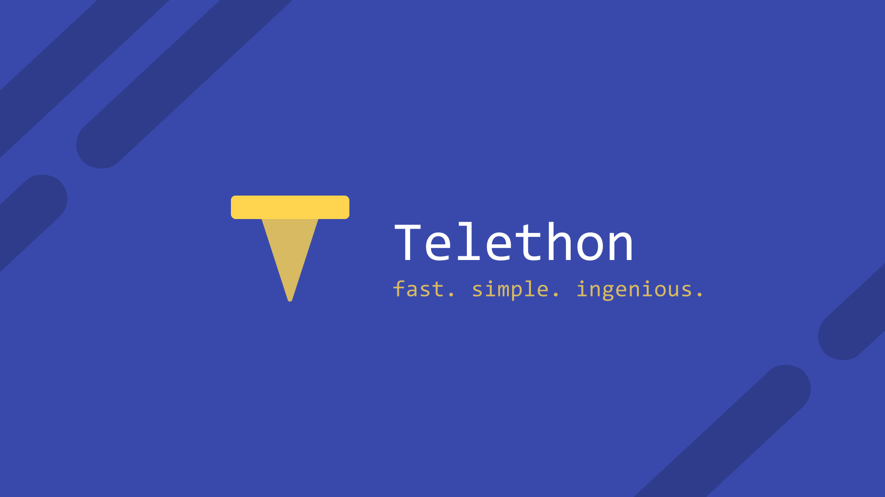

# Telethon's Documentation



## Getting Started

```python
from telethon.sync import TelegramClient, events

with TelegramClient('name', api_id, api_hash) as client:
  client.send_message('me', 'Hello, myself!')
  print(client.download_profile_photo('me'))

  @client.on(events.NewMessage(pattern='(?i).*Hello'))
  async def handler(event):
     await event.reply('Hey!')

  client.run_until_disconnected()
```

* Are you new here? Jump straight into [Installation](basic/installation.md)!
* Looking for the method reference? See [Client Reference]().
* Did you upgrade the library? Please read [Changelog (Version History)](./misc/changelog.md).
* Used Telethon before v1.0? See [Compatibility and Convenience](misc/compatibility-and-convenience.md).
* Coming from Bot API or want to create new bots? See [HTTP Bot API vs MTProto](concepts/botapi-vs-mtproto.md).
* Need the full API reference? <https://tl.telethon.dev>.


## What is this?

Telegram is a popular messaging application. This library is meant
to make it easy for you to write Python programs that can interact
with Telegram. Think of it as a wrapper that has already done the
heavy job for you, so you can focus on developing an application.


## How should I use the documentation?

If you are getting started with the library, you should follow the
documentation in order by pressing the "Next" button at the bottom-right
of every page.

You can also use the menu on the left to quickly skip over sections.
